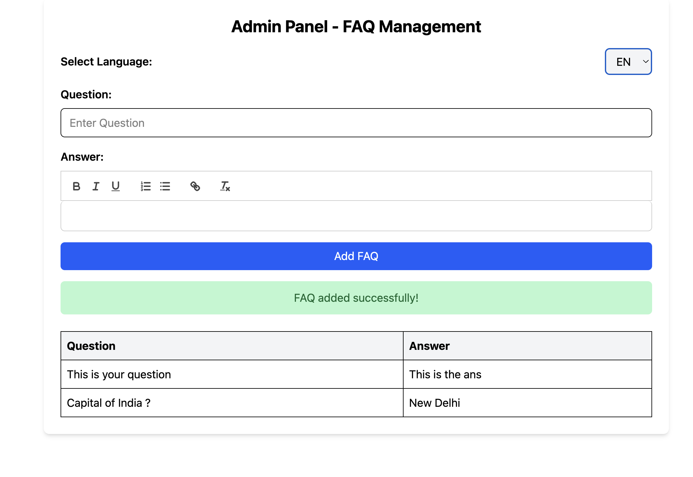
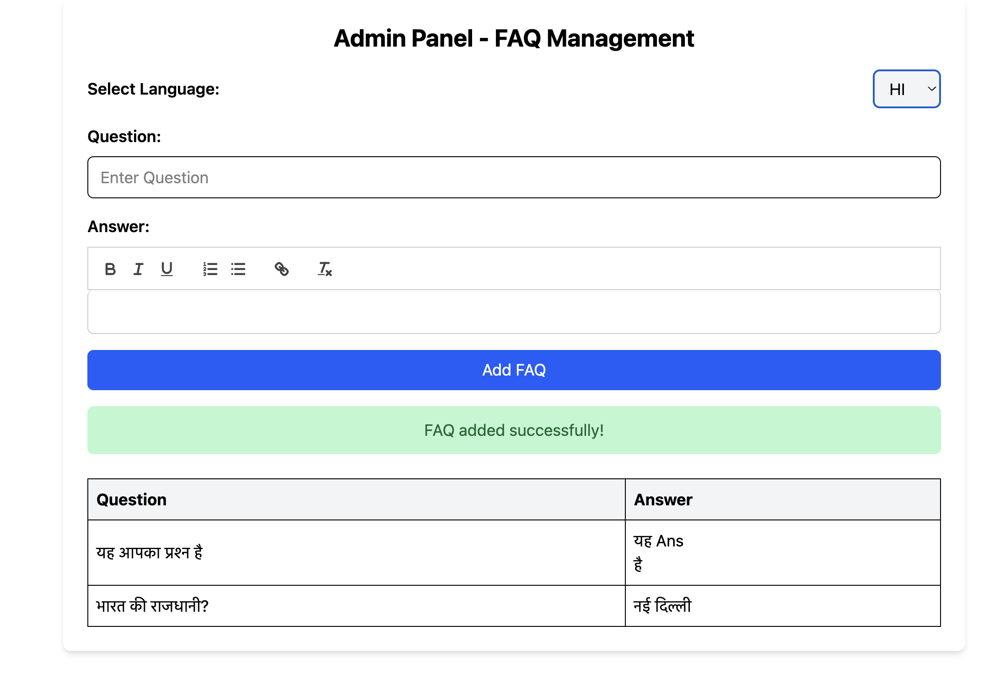

# FAQ Management System - Frontend 🚀

The **Frontend** of the **FAQ Management System** is built using **React**, **Quill.js**, and **Tailwind CSS**. It provides an intuitive **Admin Panel** for managing FAQs, translations, and more. The frontend communicates with the backend to retrieve and display FAQs and allows the admin to perform CRUD operations.

---

## Table of Contents 📚

- [Features](#features-)
- [Tech Stack](#tech-stack-)
- [Installation](#installation-)
  - [Frontend Setup](#frontend-setup-)
- [Usage](#usage-)
  - [Admin Panel](#admin-panel-)
- [Development](#development-)
  - [Running Tests](#running-tests-)
  - [Git Commit Messages](#git-commit-messages-)
- [Contributing](#contributing-)

---

## Features ✨

- **Admin Panel:** A modern interface for managing FAQs, including adding, updating, and archiving.
- **Multilingual Support:** Ability to view and manage FAQs in multiple languages.
- **WYSIWYG Editor:** Integrated **Quill.js** editor for formatting FAQ answers.
- **Responsive UI:** Built with **Tailwind CSS** for a clean and mobile-responsive design.
- **Real-Time Updates:** Seamless integration with the backend for real-time data updates.

---

## Tech Stack 🛠️

- **React:** For building the Admin Panel.
- **Quill.js:** For WYSIWYG editor support to format FAQ answers.
- **Tailwind CSS:** For styling the admin panel.
- **React Router:** For routing and navigation between pages.
- **Axios:** For making API requests to the backend.

---

## Installation 🚀

### Frontend Setup

1. **Clone the repository:**

   ```bash
   git clone https://github.com/Prayag-09/faq-management-bharatfd.git
   cd faq-management-bharatfd/app
   ```

2.  **Install dependencies:**

   ```bash
   npm install
   ```

3. **Start the frontend:**

   ```bash
   npm run dev
   ```

   The frontend will be available at [http://localhost:5173](http://localhost:5173) (default Vite port).

---

## Usage 📖

### Admin Panel

The **Admin Panel** allows you to:

- **View all FAQs:** Browse through all FAQs in a clean and organized table.
- **Add FAQs:** Create new FAQs with a rich text editor for answers.
- **Update FAQs:** Edit existing FAQs to keep the content up-to-date.
- **Translate FAQs:** Translate FAQ content into multiple languages.
- **Archive FAQs:** Archive outdated or irrelevant FAQs.

Here’s a screenshot of the Admin Panel:

English


Hindi


Portuguese


---

## Development 🛠️

### Git Commit Messages

We follow **conventional commit messages** for clear versioning. Examples:

- `feat: Add multilingual FAQ model`
- `fix: Improve translation caching`
- `docs: Update README with Admin Panel images`

---

## Contributing 🤝

We welcome contributions! To contribute:

1. Fork the repository.
2. Create a new branch (e.g., `git checkout -b feature-branch`).
3. Commit your changes (`git commit -m "feat: Add new feature"`).
4. Push to the branch (`git push origin feature-branch`).
5. Create a pull request.

---
## Acknowledgments 🙏

- **React** for building a dynamic and responsive frontend.
- **Quill.js** for providing a powerful WYSIWYG editor.
- **Tailwind CSS** for making the UI clean and responsive.
- **Vite** for fast and efficient development.

---

Made with ❤️ by [Prayag Tushar](https://github.com/Prayag-09). Let's build something amazing together! 🚀
