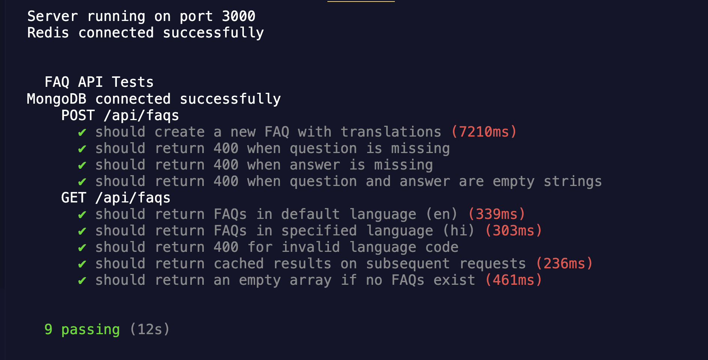

# FAQ Management System - Backend 🔧

The **Backend** of the **FAQ Management System** is built using **Node.js** (Express), **MongoDB** (for data storage), and **Redis** (for caching). It provides a REST API for managing FAQs, supporting multilingual content, and uses the **Google Translate API** for automatic translations.

---

## Table of Contents 📚

- [Features](#features-)
- [Tech Stack](#tech-stack-)
- [Installation](#installation-)
  - [Backend Setup](#backend-setup-)
- [API Endpoints](#api-endpoints-)
  - [FAQ Management](#faq-management-)
  - [Translation API](#translation-api-)
- [Development](#development-)
  - [Running Tests](#running-tests-)
  - [Git Commit Messages](#git-commit-messages-)
- [Contributing](#contributing-)

---

## Features ✨

- **Multilingual API:** Supports fetching FAQs in multiple languages with dynamic translation.
- **Caching:** Uses Redis for caching translated FAQs to enhance performance.
- **WYSIWYG Content:** Supports rich text content
- **Docker Support:** Dockerized application for easy setup and deployment.
- **Scalable Architecture:** Built with Node.js and Express for high performance and scalability.

---

## Tech Stack 🛠️

- **Backend:**

  - Node.js (Express, JavaScript)
  - MongoDB (for data storage)
  - Redis (for caching)
  - Google Translate API (for automated translations)

- **Testing:**

  - Mocha and Chai (for testing)

- **DevOps:**
  - Docker (for containerization)
  - Docker Compose (for managing multi-container applications)

---

## Installation 🚀

### Backend Setup

1. **Clone the repository:**

   ```bash
   git clone https://github.com/Prayag-09/faq-management-bharatfd.git
   cd faq-management-bharatfd/server
   ```

2. **Install dependencies:**

   ```bash
   npm install
   ```

3. **Set up environment variables:**

   Create a `.env` file in the `server` directory and add the following keys (replace with your own values):

   ```env
   MONGO=mongodb+srv://<your-db-credentials>
   REDIS_URL=redis://localhost:6379
   TRANSLATE_API_KEY=your-google-translate-api-key
   PORT=3000
   ```

4. **Run the server:**

   ```bash
   npm start
   ```

5. **Run with Docker (optional):**

   To run the backend with Docker, use the following command:

   ```bash
   docker compose up -d
   ```

   This will start the backend, MongoDB, and Redis services.

---

## API Endpoints 📚

### FAQ Management

- **Fetch all FAQs (default language: English):**

  ```bash
  GET /api/faqs
  ```

- **Create a new FAQ:**
  ```bash
  POST /api/faqs
  ```

### Fetch FAQs in Different Languages

- **English (default):**

  ```bash
  http://localhost:3000/api/faqs/
  ```

- **Hindi:**

  ```bash
  http://localhost:3000/api/faqs/?lang=hi
  ```

- **Bengali:**
  ```bash
  http://localhost:3000/api/faqs/?lang=bn
  ```

### Translation API

The backend uses the **Google Translate API** for language translations. Translations are cached in Redis to improve performance.

---

## Development 🛠️

### Running Tests

This project uses **Mocha** and **Chai** for testing. To run the tests, execute the following command:

```bash
npm test
```

### Git Commit Messages

We follow **conventional commit messages** for version control. Examples:

- `feat: Add multilingual FAQ model`
- `fix: Improve translation caching`
- `docs: Update README with API examples`

---

## Contributing 🤝

We welcome contributions! To contribute:

1. Fork the repository.
2. Create a new branch (e.g., `git checkout -b feature-branch`).
3. Commit your changes (`git commit -m "feat: Add new feature"`).
4. Push to the branch (`git push origin feature-branch`).
5. Create a pull request.

---

## Acknowledgments 🙏

- **Google Translate API** for providing seamless translation capabilities.
- **MongoDB** and **Redis** for efficient data storage and caching.
- **Node.js** and **Express** for building a scalable backend.

---

Made with ❤️ by [Prayag Tushar](https://github.com/Prayag-09). Let's build something amazing together! 🚀
